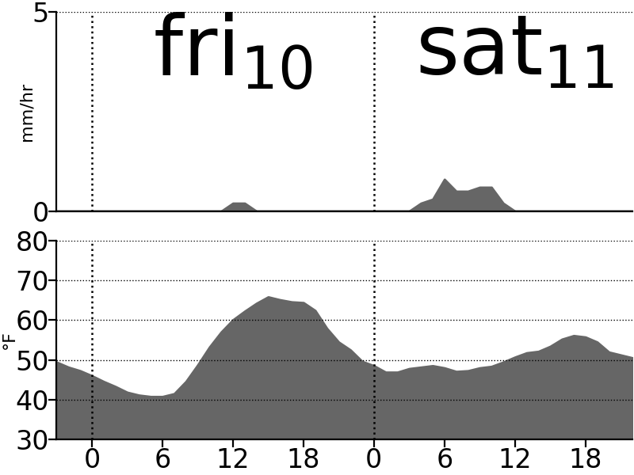

# TRMNL Weather Plot

Generate images for TRMNL to show weather forecast plots.

Stacked plot of temperature and rainfall density.
Optimized for small grayscale screen, viewable from across the room.

## How do I use it?

* Read https://help.trmnl.com/en/articles/13213669-webhook-image-experimental
* Fork this repo
* Modify config.yaml for your location and other preferences
* Set `TRMNL_WEBHOOK_POST_URL` in github actions repository secrets
* Either wait an hour for it to run on schedule, or start a job manually to test it

## How does it work?

### In Python

* Take arguments on command line
  * webhook URL, string
  * user-agent, string
* Take arguments from a config
  * duration, hours.
  * location (lat, lon)
  * y axis limits for rain & temperature
  * image dimensions, pixels.
* if user-agent provided, grab hourly weather forecast from api.met.no
  * get temperature and rainfall over the duration
  * Use lat, lon
  * Use user-agent to identify self to api.met.no
* Generate a stacked grayscale plot
  * x axis is duration. with hours in 24-hour format (0-23)
  * y axis limits are fixed by config input, not scaled to data
  * Top plot is temperature (deg F).
  * Bottom plot is rainfall density (mm/hour).
  * day of week (and date number?) are shown. Centered on noon of that day, if there is enough space.
  * Vertical dashed line at midnight
  * Linear interpolation between measurements (lines not bar graphs)
  * Gray shading underneath lines
* Create image as png with requested size. Save to disk in current working directory.
* If url provided, POST image to the webhook URL

### In Github actions

* Schedule: Every hour, run `main.py`.
* Set user agent to URL of this repository (don't hard code because people may fork)
* Use webhook URL from a secrets database

## TODO

* Configurable units
* Configurable image rotation

## License

Shield: [![CC BY-SA 4.0][cc-by-sa-shield]][cc-by-sa]

This work is licensed under a
[Creative Commons Attribution-ShareAlike 4.0 International License][cc-by-sa].

[![CC BY-SA 4.0][cc-by-sa-image]][cc-by-sa]

[cc-by-sa]: http://creativecommons.org/licenses/by-sa/4.0/
[cc-by-sa-image]: https://licensebuttons.net/l/by-sa/4.0/88x31.png
[cc-by-sa-shield]: https://img.shields.io/badge/License-CC%20BY--SA%204.0-lightgrey.svg
